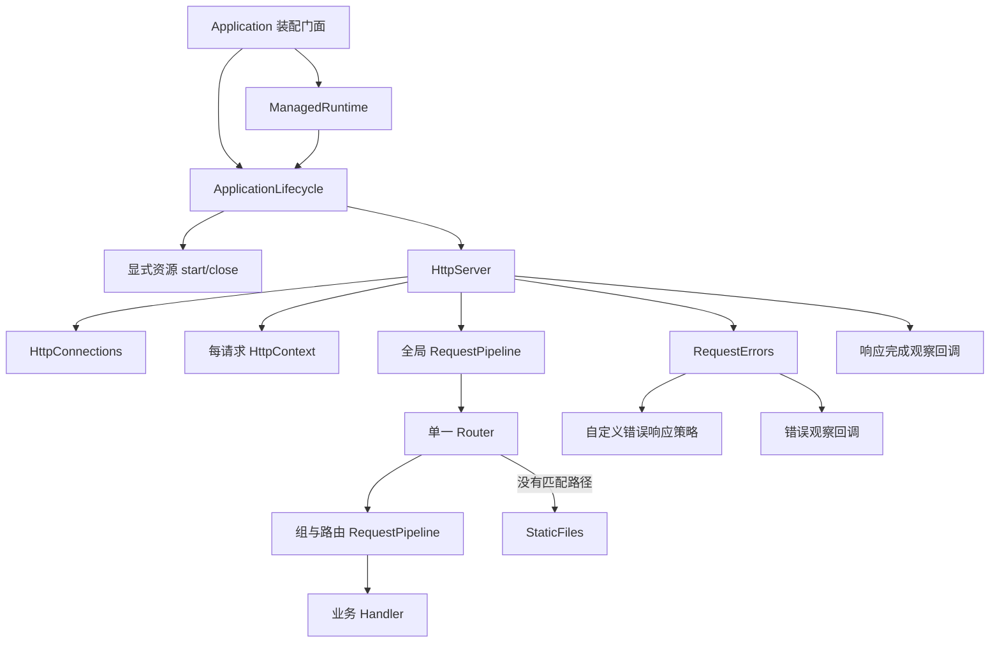

# 架构与扩展边界

## 两层运行时

core 是不规定业务结构的基础能力包，通过 createHttpApp 创建应用，内部 Application 类不再从包根导出。framework 仅依赖 core 公开入口，通过 createApplication 执行模块和 Controller 工厂装配，返回同一个 HttpApp。core 不导入 framework 或业务源码。

examples/basic 直接消费 core；examples/todo 通过 framework 声明模块，领域对象属于示例。CLI 提供 basic/framework 模板，编译规则相同。模块不是包：一个应用或包可以包含多个业务模块。

框架不复制 Router、RequestPipeline、HttpContext 或生命周期。装饰器与反射容器未实现；显式工厂支持类及普通对象，无强制继承。

目标是可组合的中小型原生 HTTP 后端框架。core 提供传输、请求处理与扩展契约，业务拥有领域规则和资源依赖。所有应用通过包根入口消费；当前实现基于 scriptc 0.0.36，不承诺 Node API 全量兼容。

## 请求与生命周期

实际终端分派由 Application 装配：先尝试 Router，仅没有匹配路径才尝试 StaticFiles。业务 404、405 或异常均不回退静态服务。

启动时 Application 冻结注册配置，ApplicationLifecycle 按注册顺序初始化资源后调用 HttpServer。HttpServer 创建监听、跟踪连接、调用处理链、捕获错误和观察响应结束。`listen()` 不注册进程信号；`run()` 由 ManagedRuntime 在初始化前添加 SIGINT/SIGTERM 托管。完整应用关闭后，经装配回调移除本实例信号监听，HttpServer 不依赖进程托管模块。

关闭继续使用已有的五秒连接排空、六秒进程兜底及重复信号策略。响应完成与业务函数完成是两个不同事件；连接关闭不隐含业务取消。显式通过 manage 注册资源时，HTTP 排空后还会等待处理函数结束，再逆序释放资源；后台任务由资源所有者自行协调。

## 采用的设计模式

| 模式 | 使用位置 | 解决的具体问题 |
| --- | --- | --- |
| 门面 Facade | Application | 消费者只需要配置和注册入口，内部传输与信号策略可以独立演进 |
| 职责链 Chain of Responsibility | RequestPipeline | 鉴权、CORS 等处理按顺序组合，支持短路和返回阶段 |
| 组合 | RouteGroup | 父组、子组和路由中间件组合，最终展开到一张路由表，避免独立匹配规则 |
| 策略 Strategy | ErrorHandler | 应用替换错误响应格式，无须改动 HTTP 请求循环 |
| 观察者 Observer | onError、onRequestComplete | 日志和指标通过明确事件接入，不和响应生成绑定 |
| 适配器 Adapter | HttpServer | 集中处理 node:http/scriptc 传输事件、连接与上下文转换 |

这些模式使用普通函数和具体类实现。没有引入通用事件总线、反射或类继承体系；framework 提供显式工厂依赖解析器。应用 Service 与 Repository 保持原有显式依赖和端口边界。

## 源码所有权

| 文件 | 所有权与职责 |
| --- | --- |
| `packages/core/src/http/application.ts` | 配置、冻结、装配、公开注册入口 |
| `applicationLifecycle.ts` | 资源启动顺序、失败回滚、启动中关闭与完整关闭结果 |
| `requestPipeline.ts` | 中间件顺序和 next 生命周期，执行状态按请求分配 |
| `routeGroup.ts` | 注册时组合前缀与中间件，内部不匹配请求 |
| `router.ts` | 路由形状、优先级、方法与参数匹配 |
| `httpContext.ts` | 请求输入、一次性读取和单次响应 |
| `httpServer.ts` | 监听、异常边界、响应完成与连接排空 |
| `managedRuntime.ts` | 信号和独立进程退出策略 |
| `requestErrors.ts` | 默认错误映射的呈现、自定义响应与观察回调隔离 |
| `httpConnections.ts` | 连接所有权和活动响应计数 |
| `staticFiles.ts` | 静态路径防护和文件响应 |
| `examples/todo/src/todos/module.ts` | Todo 依赖选择与实例装配 |
| `packages/cli/src/native/compiler.ts` | 仅开发环境使用的 TS7 源码图整理与编译调用 |

HttpServer、ApplicationLifecycle、ManagedRuntime、RequestPipeline、RequestErrors 没有从包根导出。Router、HttpContext 集成方法供当前运行时使用，应用优先使用 Application 和 RouteGroup。API 调整按当前消费者迁移，不保留旧版本兼容层。

## 稳定契约

- 配置实例隔离；全局中间件在启动时复制，组中间件和路由中间件在注册时复制。
- 保留分组对象也无法在启动后注册路由。启动尝试失败后仍不可重启，与历史行为一致。
- 路由前缀不改变 404/405、静态段优先、尾斜杠和 HEAD 语义。
- next 每层至多一次，必须 await 或 return。运行时拒绝重复和完成后的调用，并发现仍有未完成下游工作的早退；不能替代静态的异步用法检查。
- 异常响应只有一个外层边界；中间件可以自行 catch 并恢复，下游错误不强制绕过中间件的正常异常处理。
- 默认未知异常隐藏细节。错误策略失效且尚未响应时回退 500，已响应后不再写入。
- 错误观察被等待；完成观察不阻塞关闭。两种回调的拒绝均被隔离，消费者仍负责避免长时间挂起和管理其外部资源。
- 完成事件每请求至多一次；以响应写入回调或提前 close 为准，不以 handler Promise 为准。

API 示例与字段语义见 [core README](../packages/core/README.md)。

## 后续功能的接入位置

| 功能 | 首选边界 | 实现前需要验证 |
| --- | --- | --- |
| CORS、请求 ID | 全局 Middleware | 预检短路、错误响应、静态资源覆盖 |
| 鉴权、权限 | 组或路由 Middleware，凭证验证由业务提供 | 请求身份传递、隔离与错误契约；不使用全局可变身份 |
| 限流 | Middleware 与独立存储依赖 | 单进程/多进程策略、原子性、超时 |
| Schema 校验 | 业务 HTTP 边界，再根据真实复用提取 | 输入失败格式、编译兼容、字段错误路径 |
| 超时与取消 | HttpServer / HttpContext | 定时器实际执行、取消传播、单次响应与连接收尾 |
| SSE、流式文件 | HttpContext 与传输生命周期 | 背压、断连、完成事件、关闭排空 |
| 持久化、事务 | 应用 Service 与 Repository | 驱动静态编译、事务和业务一致性 |
| 外部资源适配 | 应用通过 manage 注册 start/close | 驱动静态编译、部分初始化清理、后台任务与自身超时 |

这些是后续归属说明，不代表已经实现对应功能。遇到多个真实消费者且语义稳定后，再提取可选包；core 不依赖应用源码。

资源管理协议已实现于 ApplicationLifecycle；数据库和队列适配器仍由应用提供。resourceLifecycle.native.ts 与 resources.test.ts 验证注册快照、顺序、失败回滚、重复关闭、启动中信号、响应后业务等待、清理失败与进程期限。嵌入式 close 没有新增回调超时，详见生命周期使用文档。

## 验证与兼容性

`pnpm check` 验证类型、静态覆盖、原生构建和集成测试。扩展入口 `packages/core/tests/extensionsServer.native.ts` 单独参与静态分析，防止可选回调仅通过类型检查却不能原生编译。

`tests/integration/extensions.test.ts` 覆盖嵌套进入/返回顺序、短路、重复 next、未等待的下游工作、分组重复路由、参数并发隔离、注册冻结、观察与错误策略故障、完成与断连。原有 Todo、静态文件、信号和连接排空测试共同验证兼容性。

scriptc 对跨 unknown 参数的自定义异常判断有限制，所以在传输 catch 处生成 RequestFailure，再传递给策略；Promise 观察使用 async/await。保留 aborted 事件导致的 C 后端回退，不启用动态引擎。中间件执行控制不提供尚未验证的请求 deadline 或自动取消保证。

日志策略由 core 的 `logger.ts` 统一拥有，Application 构造时注入请求、传输及进程生命周期组件。业务通过 logger 配置选择内置格式、静默或自定义出口；观察回调保持独立。日志出口异常被隔离，不改变响应和退出行为。

## CLI 包边界

`@backts/core` 只交付框架 TS 源码。`@backts/cli` 交付 Node 可执行 JS、原生编译适配、basic/framework 模板和构建时生成的依赖版本清单；固定依赖 scriptc 与 TypeScript 的已验证版本。CLI 的 creation 模块统一生成应用 package.json，模板不维护版本。构建读取各包的公开包元数据，安装后的 CLI 只使用自身发布产物。`create-backts` 通过 CLI 根导出的 `runCli()` 实现创建入口，不复制模板或生成逻辑。CLI 不导入示例或 core 私有源码，模板应用通过 `@backts/core` 的 exports 导入框架。发布关联与检查见[版本与发布](releasing.md)。

原生测试发现与准备由 CLI 的 `native/tests.ts` 拥有，公开入口为 `@backts/cli/testing`。根 package.json 直接使用 pnpm 递归命令，无自定义任务编排。模板目前无需独立包或生成插件协议。

## 可选结果适配层

`http/resultHandler.ts` 由 core 拥有，将类型化结果处理器适配为已有 Handler。它在处理成功后依次转换、显式序列化和发送 JSON，不新增请求管线或路由注册机制。转换阶段保持结果类型，响应结构包装由序列化函数拥有。所有步骤的异常进入原有错误边界，响应完成仍由 HttpServer 观察。

framework 的 jsonRoute 复用此适配器并根据泛型结果自动序列化；Todo 和 framework 模板采用函数式返回值接口。core 提供显式序列化与直接响应 API。`resultServer.native.ts` 与 `results.test.ts` 验证原生结果转换、配置快照、并发隔离、短路、HEAD、错误恢复和禁止重复发送。

## 声明式模块与路由

framework/module.ts 拥有 defineModule 和 ApplicationModule 声明；application.ts 在执行工厂前快照和预检整个 imports 图，按父节点优先装配。重复身份、名称和循环导入分别报错，不隐式共享或去重。moduleScope.ts 负责显式工厂及资源注册，controllerRoutes.ts 将路由描述适配到 core 注册入口。core 不感知模块图。

Todo 的 appModule.ts 组合 TodoModule 与 HealthModule；TodoModule 在每次应用装配时创建仓储。main 配置全局中间件、静态目录和启动。scope.mount 和 modules 数组入口迁移为单根 module 与声明式 imports。provider 实例按应用与注册模块复用，资源生命周期仍由 core 管理。

装饰器原生探针位于 experiments/decorators；0.0.36 简单类装饰器通过，方法装饰器报 SC1090。本轮不提供装饰器公共 API 或 CLI 转译。未来可用的装饰器应产出相同声明，不复制模块装配/路由运行时。

## Controller 执行边界

framework/controller.ts 拥有类型化接口声明、配置快照、实例绑定、JSON/204 适配和 Error 映射执行。每条 jsonRoute 在类型擦除前保存泛型序列化闭包；各接口可返回不同类型，不通过 unknown 或反射统一序列化。声明最终注册进 core 的同一路由表与请求链。

framework/functionalController.ts 提供 controller 和 get/post/put/patch/del/head/options 方法入口，保留严格 json，移除顶层 noContent。方法与响应策略独立：有结果默认 JSON 200，无结果默认 204；显式 status 优先。CLI routeLowering 按框架声明身份与类型适配纯 void 路由到公开的 framework/native 子路径，原始源码先验证类型，业务文件不被改写。core.resultHandler 的可选 emptyStatus 保持旧严格 JSON 契约；HttpContext.empty 负责空响应状态。它将直接业务处理器适配到已有 ControllerEndpoint 与异常边界，保留每个接口的具体结果类型；同步和异步结果经 await 适配到 core 的异步结果处理。controller 静态配置在声明时快照，有依赖的装配回调按应用/模块执行并在返回时快照，不保存运行期 resolver。

应用保留处理函数、输入验证、返回数据和错误映射规则，业务 Service 不依赖 framework。现有 defineController/provideController 继续支持类实例与显式 action。当前 scriptc 不支持字符串方法选择或方法引用；函数式接口避免重复方法转调，不引入动态引擎或编译期转译。functionalController.native.ts 与 framework.test.ts 验证新入口的同步/异步结果、配置快照、依赖装配与响应边界。

## 依赖装配所有权

provider.ts 保存类型化 token、默认工厂、替换绑定和可选生命周期；providerResolver.ts 检查模块可见性并解析依赖；controllerProvider.ts 将解析器接到已有 Controller 注册器。application.ts 先快照模块与绑定、验证导出，再解析 providers、注册 controllers，最后执行自定义 configure。

scriptc 不支持 unknown 容器字段，因此实例不放入擦除类型的通用 Map。每个 token 的泛型闭包仅在同步装配期间保存以唯一 slot 区分的临时值，finally 清空，业务实例由消费者持有。该实现不提供运行期 get 或异步工厂解析。

Controller interceptors 复用 core 请求链，结果 transforms 复用 resultHandler。依赖资源通过 core.manage 启停，没有第二个资源生命周期。默认 Todo 和 framework 模板均使用 providers/controllers 声明；core 仍可完全独立用于函数式应用。
