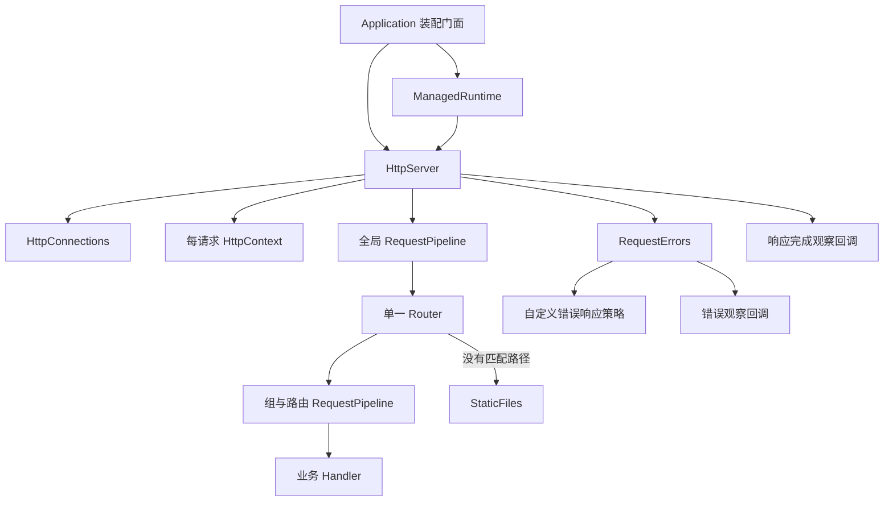

# 架构与扩展边界

目标是可组合的中小型原生 HTTP 后端框架。core 提供传输、请求处理与扩展契约，业务拥有领域规则和资源依赖。所有应用通过包根入口消费；当前实现基于 scriptc 0.0.36，不承诺 Node API 全量兼容。

## 请求与生命周期

实际终端分派由 Application 装配：先尝试 Router，仅没有匹配路径才尝试 StaticFiles。业务 404、405 或异常均不回退静态服务。

启动时 Application 冻结注册配置。HttpServer 创建监听、跟踪连接、调用处理链、捕获错误和观察响应结束。`listen()` 不注册进程信号；`run()` 由 ManagedRuntime 添加 SIGINT/SIGTERM 托管。HTTP 关闭完成后，经装配回调移除本实例信号监听，HttpServer 不依赖进程托管模块。

关闭继续使用已有的五秒连接排空、六秒进程兜底及重复信号策略。响应完成与业务函数完成是两个不同事件；连接关闭不隐含业务取消。当前不管理数据库、队列或日志后台任务的关闭。

## 采用的设计模式

| 模式 | 使用位置 | 解决的具体问题 |
| --- | --- | --- |
| 门面 Facade | Application | 消费者只需要配置和注册入口，内部传输与信号策略可以独立演进 |
| 职责链 Chain of Responsibility | RequestPipeline | 鉴权、CORS 等处理按顺序组合，支持短路和返回阶段 |
| 组合 | RouteGroup | 父组、子组和路由中间件组合，最终展开到一张路由表，避免独立匹配规则 |
| 策略 Strategy | ErrorHandler | 应用替换错误响应格式，无须改动 HTTP 请求循环 |
| 观察者 Observer | onError、onRequestComplete | 日志和指标通过明确事件接入，不和响应生成绑定 |
| 适配器 Adapter | HttpServer | 集中处理 node:http/scriptc 传输事件、连接与上下文转换 |

这些模式使用普通函数和具体类实现。没有引入通用事件总线、反射、容器或类继承体系。应用 Service 与 Repository 保持原有显式依赖和端口边界。

## 源码所有权

| 文件 | 所有权与职责 |
| --- | --- |
| `packages/core/src/http/application.ts` | 配置、冻结、装配、公开注册入口 |
| `requestPipeline.ts` | 中间件顺序和 next 生命周期，执行状态按请求分配 |
| `routeGroup.ts` | 注册时组合前缀与中间件，内部不匹配请求 |
| `router.ts` | 路由形状、优先级、方法与参数匹配 |
| `httpContext.ts` | 请求输入、一次性读取和单次响应 |
| `httpServer.ts` | 监听、异常边界、响应完成与连接排空 |
| `managedRuntime.ts` | 信号和独立进程退出策略 |
| `requestErrors.ts` | 默认错误映射的呈现、自定义响应与观察回调隔离 |
| `httpConnections.ts` | 连接所有权和活动响应计数 |
| `staticFiles.ts` | 静态路径防护和文件响应 |
| `examples/todo/src/todos/registerRoutes.ts` | Todo 自身的 HTTP 路由映射 |
| `scripts/compileNative.ts` | 仅开发环境使用的 TS7 源码图整理与编译调用 |

HttpServer、ManagedRuntime、RequestPipeline、RequestErrors 没有从包根导出。现有 Router、HttpContext 集成方法保留兼容，应用优先使用 Application 和 RouteGroup。未为了隐藏历史 API 引入新的接口层或破坏迁移。

## 稳定契约

- 配置实例隔离；全局中间件在启动时复制，组中间件和路由中间件在注册时复制。
- 保留分组对象也无法在启动后注册路由。启动尝试失败后仍不可重启，与历史行为一致。
- 路由前缀不改变 404/405、静态段优先、尾斜杠和 HEAD 语义。
- next 每层至多一次，必须 await 或 return。运行时拒绝重复和完成后的调用，并发现仍有未完成下游工作的早退；不能替代静态的异步用法检查。
- 异常响应只有一个外层边界；中间件可以自行 catch 并恢复，下游错误不强制绕过中间件的正常异常处理。
- 默认未知异常隐藏细节。错误策略失效且尚未响应时回退 500，已响应后不再写入。
- 错误观察被等待；完成观察不阻塞关闭。两种回调的拒绝均被隔离，消费者仍负责避免长时间挂起和管理其外部资源。
- 完成事件每请求至多一次；以响应写入回调或提前 close 为准，不以 handler Promise 为准。

API 示例与字段语义见 [core README](../packages/core/README.md)。

## 后续功能的接入位置

| 功能 | 首选边界 | 实现前需要验证 |
| --- | --- | --- |
| CORS、请求 ID | 全局 Middleware | 预检短路、错误响应、静态资源覆盖 |
| 鉴权、权限 | 组或路由 Middleware，凭证验证由业务提供 | 请求身份传递、隔离与错误契约；不使用全局可变身份 |
| 限流 | Middleware 与独立存储依赖 | 单进程/多进程策略、原子性、超时 |
| Schema 校验 | 业务 HTTP 边界，再根据真实复用提取 | 输入失败格式、编译兼容、字段错误路径 |
| 超时与取消 | HttpServer / HttpContext | 定时器实际执行、取消传播、单次响应与连接收尾 |
| SSE、流式文件 | HttpContext 与传输生命周期 | 背压、断连、完成事件、关闭排空 |
| 持久化、事务 | 应用 Service 与 Repository | 驱动静态编译、事务和业务一致性 |
| 外部资源启动/关闭 | 应用装配与生命周期 | 顺序、部分启动失败回滚、幂等清理与期限 |

这些是后续归属说明，不代表已经实现对应功能。遇到多个真实消费者且语义稳定后，再提取可选包；core 不依赖应用源码。

## 验证与兼容性

`pnpm check` 验证类型、静态覆盖、原生构建和集成测试。扩展入口 `packages/core/tests/extensionsServer.native.ts` 单独参与静态分析，防止可选回调仅通过类型检查却不能原生编译。

`tests/integration/extensions.test.ts` 覆盖嵌套进入/返回顺序、短路、重复 next、未等待的下游工作、分组重复路由、参数并发隔离、注册冻结、观察与错误策略故障、完成与断连。原有 Todo、静态文件、信号和连接排空测试共同验证兼容性。

scriptc 对跨 unknown 参数的自定义异常判断有限制，所以在传输 catch 处生成 RequestFailure，再传递给策略；Promise 观察使用 async/await。保留 aborted 事件导致的 C 后端回退，不启用动态引擎。中间件执行控制不提供尚未验证的请求 deadline 或自动取消保证。

日志策略由 core 的 `logger.ts` 统一拥有，Application 构造时注入请求、传输及进程生命周期组件。业务通过 logger 配置选择内置格式、静默或自定义出口；观察回调保持独立。日志出口异常被隔离，不改变响应和退出行为。
